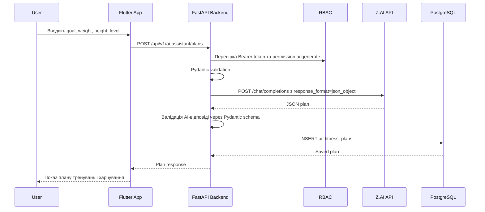

# FitTrack - AI Fitness Assistant

## 1. Призначення

AI Fitness Assistant - це модуль FitTrack, який створює персональний план тренувань і базові рекомендації з харчування на основі чотирьох параметрів користувача:

- ціль тренувань;
- вага;
- зріст;
- рівень підготовки.

Модуль використовує Z.AI Chat Completions API на backend-рівні. Мобільний застосунок не має прямого доступу до API key, тому секрет не потрапляє у Flutter-код, APK/IPA або GitHub repository.

## 2. API Flow



## 3. Backend API

Base path:

```text
/api/v1
```

### POST `/ai-assistant/plans`

Створює новий AI-план.

Auth:

```text
Bearer token + permission ai:generate
```

Rate limit:

```text
5 requests / minute
```

Request body:

```json
{
  "goal": "muscle_gain",
  "weight_kg": 78,
  "height_cm": 178,
  "fitness_level": "beginner"
}
```

Allowed values:

- `goal`: `weight_loss`, `muscle_gain`, `strength`, `endurance`, `general_fitness`;
- `fitness_level`: `beginner`, `intermediate`, `advanced`;
- `weight_kg`: 25-300;
- `height_cm`: 80-250.

Response `201 Created`:

```json
{
  "id": "uuid",
  "user_id": "uuid",
  "goal": "muscle_gain",
  "weight_kg": 78,
  "height_cm": 178,
  "fitness_level": "beginner",
  "summary": "Short plan explanation",
  "workout_plan": {
    "weekly_schedule": [
      {
        "day": 1,
        "focus": "Full body strength",
        "duration_minutes": 45,
        "warm_up": ["5 min treadmill"],
        "exercises": [
          {
            "name": "Goblet squat",
            "muscle_group": "legs",
            "equipment": "dumbbell",
            "sets": 3,
            "reps": "10-12",
            "rest_seconds": 90,
            "technique_tip": "Keep chest tall."
          }
        ],
        "cooldown": ["hamstring stretch"]
      }
    ],
    "progression": ["Increase load gradually each week."]
  },
  "nutrition_recommendations": {
    "calories_per_day": 2400,
    "protein_g": 150,
    "fats_g": 75,
    "carbs_g": 280,
    "meals_per_day": 4,
    "hydration_liters": 2.5,
    "recommendations": ["Eat protein with each meal."]
  },
  "safety_notes": ["Stop if sharp pain appears."],
  "model": "glm-5.2",
  "status": "generated",
  "created_at": "2026-07-27T12:00:00Z",
  "updated_at": "2026-07-27T12:00:00Z"
}
```

Possible errors:

| Code | Reason |
| --- | --- |
| `401` | Invalid or missing Bearer token |
| `403` | Missing permission `ai:generate` |
| `422` | Invalid goal, level, weight, or height |
| `429` | Too many generation requests |
| `502` | Z.AI API unavailable or returned invalid JSON |
| `503` | `ZAI_API_KEY` is not configured |
| `504` | Z.AI request timeout |

### GET `/ai-assistant/plans`

Повертає історію AI-планів поточного користувача.

Query:

```text
limit=20
```

Response:

```json
[
  {
    "id": "uuid",
    "goal": "muscle_gain",
    "fitness_level": "beginner",
    "summary": "Short plan explanation",
    "model": "glm-5.2",
    "status": "generated",
    "created_at": "2026-07-27T12:00:00Z"
  }
]
```

### GET `/ai-assistant/plans/{plan_id}`

Повертає один збережений план. Backend перевіряє, що `plan_id` належить поточному користувачу.

## 4. Z.AI Integration

Backend викликає:

```text
POST https://api.z.ai/api/paas/v4/chat/completions
```

Headers:

```http
Authorization: Bearer ${ZAI_API_KEY}
Content-Type: application/json
Accept-Language: en-US,en
```

Body:

```json
{
  "model": "glm-5.2",
  "messages": [
    {
      "role": "system",
      "content": "You are FitTrack AI Fitness Assistant..."
    },
    {
      "role": "user",
      "content": "Create a personalized plan..."
    }
  ],
  "temperature": 0.35,
  "max_tokens": 3000,
  "stream": false,
  "thinking": {
    "type": "disabled"
  },
  "response_format": {
    "type": "json_object"
  },
  "request_id": "fittrack-generated-uuid",
  "user_id": "fittrack-user-uuid"
}
```

Відповідь AI додатково перевіряється на backend через `AIFitnessPlanContent`, щоб Flutter отримував стабільну структуру.

## 5. Environment

`.env`:

```env
ZAI_API_KEY=your_zai_api_key
ZAI_BASE_URL=https://api.z.ai/api/paas/v4
ZAI_CHAT_MODEL=glm-5.2
ZAI_TIMEOUT_SECONDS=30
```

Секретний ключ не додається в repository. Для демо його потрібно встановити локально або через secret manager/cloud environment variables.

## 6. Database

Нова таблиця:

```text
ai_fitness_plans
```

Поля:

| Field | Type | Description |
| --- | --- | --- |
| `id` | UUID PK | Ідентифікатор плану |
| `user_id` | UUID FK -> users.id | Власник плану |
| `goal` | fittrack_training_goal | Ціль тренувань |
| `weight_kg` | NUMERIC(5,2) | Вага користувача |
| `height_cm` | NUMERIC(5,2) | Зріст користувача |
| `fitness_level` | fittrack_fitness_level | Рівень підготовки |
| `prompt_payload` | JSONB | Вхідні дані, передані в AI |
| `summary` | TEXT | Коротке пояснення плану |
| `workout_plan` | JSONB | Структурований план тренувань |
| `nutrition_recommendations` | JSONB | Калорії, БЖВ, вода, поради |
| `safety_notes` | JSONB | Обмеження та safety reminders |
| `raw_ai_response` | JSONB | Сира відповідь AI для audit/debug |
| `model` | VARCHAR(80) | Назва Z.AI model |
| `status` | VARCHAR(20) | `generated` або `failed` |
| `error_message` | TEXT | Текст помилки, якщо генерація неуспішна |
| `created_at` | TIMESTAMPTZ | Дата створення |
| `updated_at` | TIMESTAMPTZ | Дата оновлення |

Indexes:

```sql
idx_ai_fitness_plans_user_created ON ai_fitness_plans(user_id, created_at DESC)
idx_ai_fitness_plans_goal ON ai_fitness_plans(goal)
```

RBAC:

```text
permission: ai:generate
roles: user, trainer, admin
```

## 7. Flutter UI

Route:

```text
/ai-assistant
```

Entry points:

- icon button on Home Dashboard app bar;
- card on Home Dashboard: `AI Fitness Assistant`.

Screen layout:

1. Header:
   - title `Personal plan generator`;
   - short description.

2. Form card:
   - `DropdownButtonFormField` for goal;
   - numeric `TextFormField` for weight;
   - numeric `TextFormField` for height;
   - `DropdownButtonFormField` for training level.

3. Main action:
   - `PrimaryButton` with `Icons.auto_awesome`;
   - loading state with `LinearProgressIndicator`.

4. Result area:
   - summary;
   - calories and macros chips;
   - first workout days;
   - safety notes.

5. History:
   - last saved AI plans from `GET /ai-assistant/plans`.

Flutter files:

```text
mobile/lib/features/ai_assistant/
  data/models/ai_fitness_plan_model.dart
  data/services/ai_assistant_api_service.dart
  presentation/providers/ai_assistant_providers.dart
  presentation/screens/ai_assistant_screen.dart
```

## 8. Security Notes

- Z.AI API key exists only on backend.
- Flutter sends only user input and Bearer token to FitTrack API.
- Endpoint requires authentication and `ai:generate` permission.
- Pydantic validates request and AI output.
- Generation endpoint has rate limiting.
- AI recommendations are educational and not a medical diagnosis.
- `user_id` sent to Z.AI is the internal UUID, not email or phone number.
