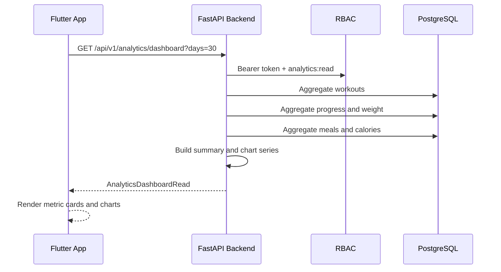

# FitTrack - аналітичний модуль

## 1. Призначення

Аналітичний модуль FitTrack показує користувачу зведену статистику тренувань, ваги, прогресу, калорій та активності за вибраний період. Модуль працює поверх уже наявних таблиць `workouts`, `progress` і `meals`, тому не дублює дані та не створює окреме сховище метрик.

## 2. Дані, які показує dashboard

- кількість тренувань;
- кількість завершених тренувань;
- середня вага;
- остання вага;
- зміна ваги за період;
- відсоток прогресу за вагою;
- загальний тренувальний обсяг;
- спалені калорії;
- спожиті калорії;
- середні калорії за день;
- активні дні;
- activity score.

## 3. API Flow



## 4. Backend API

### GET `/analytics/dashboard`

Повертає аналітичний dashboard поточного користувача.

Auth:

```text
Bearer token + permission analytics:read
```

Query:

```text
days=7|30|90
```

Backend дозволяє діапазон `7..365`.

Response:

```json
{
  "period": {
    "from_date": "2026-06-28",
    "to_date": "2026-07-27",
    "days": 30
  },
  "summary": {
    "workout_count": 12,
    "completed_workout_count": 10,
    "active_days": 18,
    "average_weight_kg": 78.4,
    "latest_weight_kg": 77.8,
    "weight_change_kg": -1.2,
    "progress_percent": -1.52,
    "total_volume_kg": 58200,
    "calories_burned": 5200,
    "calories_consumed": 64200,
    "average_daily_calories": 2140,
    "activity_score": 60
  },
  "weight_chart": [
    {
      "date": "2026-07-01",
      "value": 79.0
    }
  ],
  "workout_activity_chart": [
    {
      "date": "2026-07-01",
      "value": 1
    }
  ],
  "volume_chart": [
    {
      "date": "2026-07-01",
      "value": 4800
    }
  ],
  "calorie_chart": [
    {
      "date": "2026-07-01",
      "consumed": 2200,
      "burned": 430
    }
  ],
  "activity": [
    {
      "date": "2026-07-01",
      "workouts_count": 1,
      "calories_burned": 430,
      "calories_consumed": 2200,
      "total_volume_kg": 4800
    }
  ]
}
```

Errors:

| Code | Reason |
| --- | --- |
| `401` | Немає або невалідний Bearer token |
| `403` | Немає permission `analytics:read` |
| `422` | Некоректне значення `days` |

## 5. Database

Аналітика читає дані з таблиць:

| Table | Поля для аналітики |
| --- | --- |
| `workouts` | `user_id`, `is_completed`, `completed_at`, `scheduled_for`, `created_at` |
| `progress` | `progress_date`, `weight_kg`, `total_volume_kg`, `calories_burned` |
| `meals` | `meal_date`, `calories`, `protein_g`, `fat_g`, `carbs_g` |

Нові таблиці не потрібні.

RBAC:

```text
permission: analytics:read
roles: user, trainer, admin
```

## 6. Flutter UI

Route:

```text
/analytics
```

Файли:

```text
mobile/lib/features/analytics/
  data/models/analytics_dashboard_model.dart
  data/services/analytics_api_service.dart
  presentation/providers/analytics_providers.dart
  presentation/screens/analytics_dashboard_screen.dart
  presentation/widgets/analytics_charts.dart
```

UI dashboard:

1. Period selector:
   - `SegmentedButton<int>`: `7d`, `30d`, `90d`.

2. Metric cards:
   - workouts;
   - average weight;
   - progress;
   - calories;
   - active days;
   - activity score.

3. Charts:
   - line chart: weight progress;
   - bar chart: workout activity;
   - line chart: training volume;
   - dual bar chart: consumed/burned calories.

4. Recent activity:
   - останні 7 днів;
   - тренування;
   - volume;
   - calories.

Графіки реалізовані через `CustomPainter`, щоб не додавати нові залежності в coursework scaffold.

## 7. UX Logic

- Home Dashboard має швидкий перехід до Analytics.
- Role-based navigation показує Analytics тільки користувачам із `analytics:read`.
- Progress screen має кнопку переходу до нового dashboard.
- При зміні періоду Flutter автоматично викликає `GET /analytics/dashboard`.
- Loading state показує `LinearProgressIndicator`.
- Error state показується в card із текстом помилки API.
