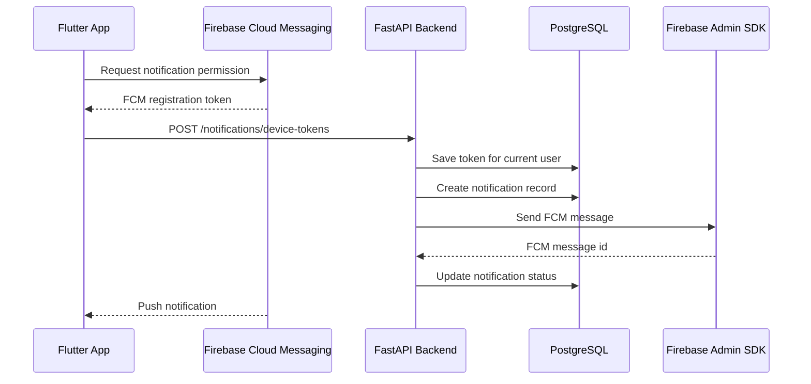

# FitTrack - система повідомлень через Firebase Cloud Messaging

## 1. Мета

Система повідомлень FitTrack використовується для:

- нагадувань про тренування;
- повідомлень про оплату Premium;
- попереджень про закінчення Premium;
- системних повідомлень для користувача.

Технологія:

- Flutter: `firebase_messaging`.
- Backend: `firebase-admin` та `firebase_admin.messaging`.
- Database: PostgreSQL таблиці для FCM device tokens, preferences та історії повідомлень.

## 2. Загальна схема



## 3. Backend

### Основні файли

| Файл | Призначення |
| --- | --- |
| `backend/app/models/notifications.py` | SQLAlchemy models |
| `backend/app/schemas/notifications.py` | Pydantic DTO |
| `backend/app/services/notification_service.py` | Бізнес-логіка та FCM відправка |
| `backend/app/api/v1/notifications.py` | REST endpoints |
| `backend/app/api/v1/router.py` | Підключення notification router |
| `backend/app/api/v1/subscription.py` | Виклик payment notification після зміни статусу платежу |

### API endpoints

Base path:

```text
/api/v1/notifications
```

| Method | URL | Auth | Опис |
| --- | --- | --- | --- |
| `POST` | `/device-tokens` | User | Зареєструвати або оновити FCM token пристрою |
| `DELETE` | `/device-tokens/{token_id}` | User | Деактивувати token пристрою |
| `GET` | `/preferences` | User | Отримати notification preferences |
| `PUT` | `/preferences` | User | Оновити preferences |
| `GET` | `` | User | Список повідомлень користувача |
| `PATCH` | `/{notification_id}/read` | User | Позначити повідомлення прочитаним |
| `POST` | `/test` | User | Надіслати тестове повідомлення на власні пристрої |

### POST `/notifications/device-tokens`

Request:

```json
{
  "fcm_token": "fcm_registration_token_from_flutter",
  "platform": "android",
  "device_id": "optional-device-id",
  "app_version": "0.1.0"
}
```

Response:

```json
{
  "id": "uuid",
  "user_id": "uuid",
  "platform": "android",
  "device_id": "optional-device-id",
  "app_version": "0.1.0",
  "is_active": true,
  "last_seen_at": "2026-07-27T12:00:00Z",
  "created_at": "2026-07-27T12:00:00Z",
  "updated_at": "2026-07-27T12:00:00Z"
}
```

### PUT `/notifications/preferences`

Request:

```json
{
  "workout_reminders_enabled": true,
  "workout_reminder_time": "09:00:00",
  "payment_notifications_enabled": true,
  "premium_expiration_enabled": true,
  "premium_expiration_days_before": 3
}
```

### POST `/notifications/test`

Request:

```json
{
  "type": "system",
  "title": "FitTrack test",
  "body": "Notifications are working.",
  "data": {
    "screen": "home"
  }
}
```

Response:

```json
{
  "notification": {
    "id": "uuid",
    "type": "system",
    "title": "FitTrack test",
    "body": "Notifications are working.",
    "status": "sent",
    "fcm_message_id": "projects/fittrack/messages/...",
    "sent_at": "2026-07-27T12:01:00Z"
  },
  "sent_count": 1,
  "failed_count": 0
}
```

### Backend notification use cases

#### Нагадування про тренування

Метод service layer:

```python
send_workout_reminder(
    user,
    workout_id="uuid",
    workout_title="Push Day",
)
```

Payload:

```json
{
  "type": "workout_reminder",
  "workout_id": "uuid"
}
```

#### Повідомлення про оплату

Метод service layer:

```python
send_payment_notification(
    user,
    payment_id="uuid",
    status="succeeded",
)
```

Типи:

- `payment_succeeded`;
- `payment_failed`;
- інші `payment_*` статуси для майбутнього розширення.

У поточній реалізації payment notification викликається після:

- manual test confirm;
- checkout session confirm;
- Stripe webhook `checkout.session.completed` або `checkout.session.expired`.

#### Закінчення Premium

Метод service layer:

```python
send_premium_expiration(
    user,
    subscription_id="uuid",
    expires_at=expires_at,
)
```

Типи:

- `premium_expiring`;
- `premium_expired`.

## 4. Database

### `notification_device_tokens`

Зберігає FCM tokens пристроїв користувача.

| Field | Type | Опис |
| --- | --- | --- |
| `id` | `UUID` | Primary key |
| `user_id` | `UUID` | FK -> `users.id` |
| `fcm_token` | `TEXT` | FCM registration token |
| `platform` | `VARCHAR(20)` | `android`, `ios`, `web` |
| `device_id` | `VARCHAR(120)` | Optional device id |
| `app_version` | `VARCHAR(40)` | Версія застосунку |
| `is_active` | `BOOLEAN` | Чи активний token |
| `last_seen_at` | `TIMESTAMPTZ` | Остання реєстрація token |
| `created_at` | `TIMESTAMPTZ` | Дата створення |
| `updated_at` | `TIMESTAMPTZ` | Дата оновлення |

### `notification_preferences`

Налаштування повідомлень користувача.

| Field | Type | Опис |
| --- | --- | --- |
| `user_id` | `UUID` | Primary key, FK -> `users.id` |
| `workout_reminders_enabled` | `BOOLEAN` | Нагадування про тренування |
| `workout_reminder_time` | `TIME` | Час нагадування |
| `payment_notifications_enabled` | `BOOLEAN` | Повідомлення про оплату |
| `premium_expiration_enabled` | `BOOLEAN` | Попередження про Premium |
| `premium_expiration_days_before` | `INTEGER` | За скільки днів попереджати |

### `notifications`

Історія повідомлень.

| Field | Type | Опис |
| --- | --- | --- |
| `id` | `UUID` | Primary key |
| `user_id` | `UUID` | FK -> `users.id` |
| `type` | `VARCHAR(40)` | Тип повідомлення |
| `title` | `VARCHAR(160)` | Заголовок |
| `body` | `TEXT` | Текст |
| `data` | `JSONB` | Deep-link payload |
| `status` | `VARCHAR(20)` | `queued`, `sent`, `failed`, `skipped`, `read` |
| `fcm_message_id` | `TEXT` | ID повідомлення від FCM |
| `error_message` | `TEXT` | Помилка відправки |
| `sent_at` | `TIMESTAMPTZ` | Час відправки |
| `read_at` | `TIMESTAMPTZ` | Час прочитання |

## 5. Flutter

### Основні файли

| Файл | Призначення |
| --- | --- |
| `mobile/pubspec.yaml` | Додає `firebase_messaging` |
| `mobile/lib/main.dart` | Реєструє background handler |
| `mobile/lib/features/notifications/data/services/fcm_notification_service.dart` | FCM permission/token/API service |
| `mobile/lib/features/notifications/presentation/providers/notification_providers.dart` | Riverpod providers |
| `mobile/lib/features/notifications/presentation/widgets/notification_bootstrap.dart` | Автоматична ініціалізація після login |

### Flutter flow

1. Після Firebase initialization застосунок реєструє background handler.
2. Після login `NotificationBootstrap` викликає `FcmNotificationService.initialize()`.
3. Flutter запитує permission на push notifications.
4. Flutter отримує FCM token.
5. Flutter викликає backend:

```text
POST /api/v1/notifications/device-tokens
```

6. При token refresh Flutter повторно реєструє новий token.
7. Foreground/background messages обробляються через Firebase Messaging streams.
8. Історія повідомлень читається з backend через:

```text
GET /api/v1/notifications
```

### Flutter dependencies

```yaml
dependencies:
  firebase_messaging: ^16.4.3
```

## 6. Environment variables

Backend:

```env
NOTIFICATIONS_ENABLED=true
FCM_DRY_RUN=false
FIREBASE_PROJECT_ID=fittrack-demo
```

Для локальної демонстрації без реальної відправки можна поставити:

```env
FCM_DRY_RUN=true
```

## 7. Security

- FCM token прив'язується тільки до поточного authenticated user.
- Видалити/deactivate token може тільки власник.
- Backend не зберігає приватні ключі у коді.
- Firebase Admin SDK використовує Application Default Credentials або service account на сервері.
- Notification preferences контролюють, які повідомлення можна надсилати.
- Історія повідомлень ізольована по `user_id`.

## 8. Production notes

- Для регулярних workout reminders потрібен scheduler: cron, Celery beat, APScheduler або cloud scheduler.
- Для Premium expiration reminders scheduler щоденно перевіряє `subscriptions.expires_at`.
- Payment notifications уже викликаються після manual confirm, checkout confirm і Stripe webhook зміни статусу payment.
- Для iOS потрібне налаштування APNs у Firebase Console.
- Для Android production потрібен реальний Firebase project і коректний `firebase_options.dart`.
