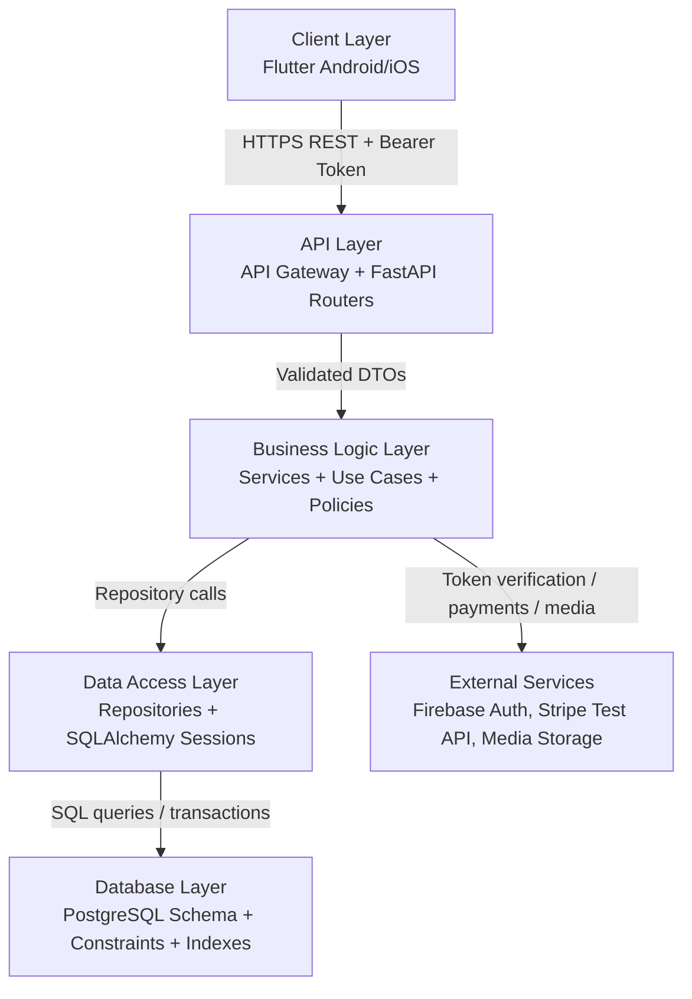
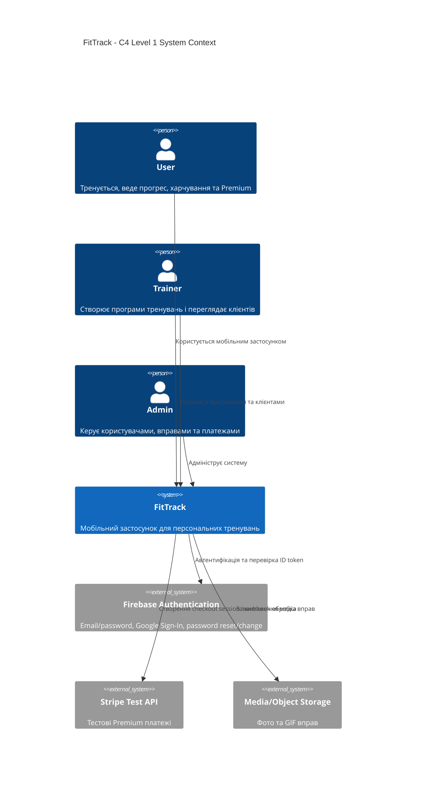
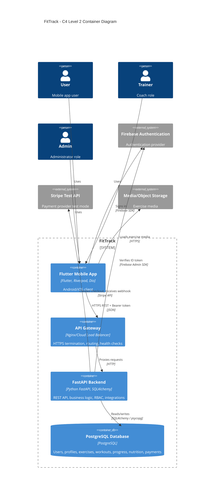
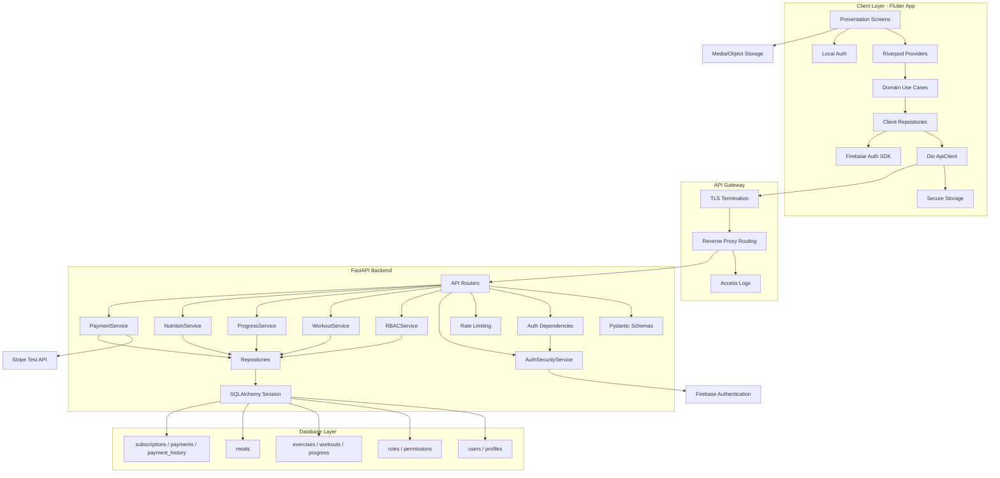
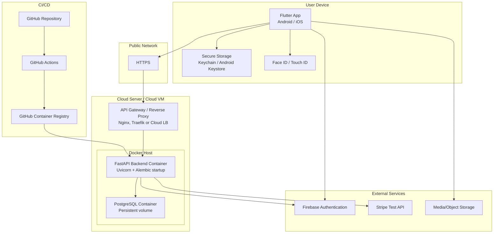
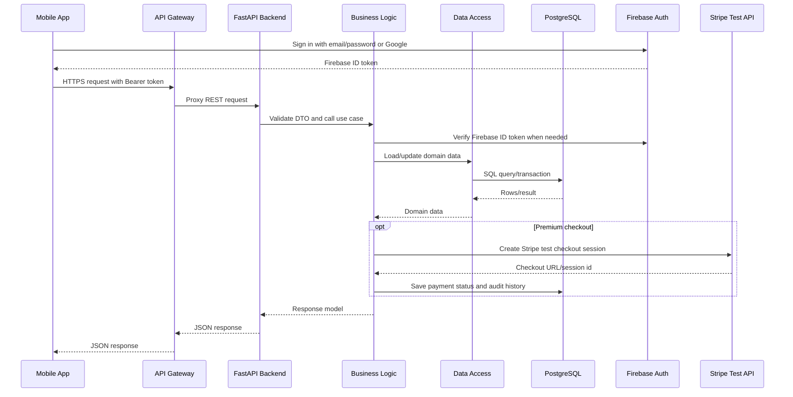

# FitTrack - програмна архітектура системи

## 1. Призначення документа

Цей документ описує програмну архітектуру FitTrack як мобільної client-server системи на базі Flutter, FastAPI та PostgreSQL. Архітектура побудована як модульний моноліт backend-частини з чітким поділом на шари: Client Layer, API Layer, Business Logic Layer, Data Access Layer та Database Layer.

Основний потік взаємодії:

```text
Mobile App -> API Gateway -> FastAPI Backend -> PostgreSQL Database
                                  |
                                  +-> Firebase Authentication
                                  +-> Stripe Test API
                                  +-> Media/Object Storage
```

## 2. Архітектурний стиль

FitTrack використовує такі архітектурні підходи:

- Client-server architecture: мобільний застосунок є клієнтом, backend відповідає за API, бізнес-правила та інтеграції.
- Clean Architecture у Flutter: `presentation`, `domain`, `data` всередині feature-модулів.
- Layered Architecture у backend: API routers, services, repositories, ORM models.
- Modular Monolith: backend розділений на модулі auth, profile, exercises, workouts, progress, nutrition, payments, admin, але деплоїться як один FastAPI service.
- REST API: взаємодія mobile/backend через HTTPS JSON endpoints.
- RBAC: ролі `User`, `Trainer`, `Admin` та permission-based access checks.
- Externalized authentication: Firebase Authentication виконує email/password, Google Sign-In, password reset/change.
- Test payment integration: Stripe використовується тільки в test mode.

## 3. Layered Architecture



## 4. Client Layer

Client Layer - це Flutter mobile app для Android та iOS.

### Відповідальність

- Відображення UI: login, dashboard, exercise library, workout builder, progress, profile, premium, admin/trainer screens.
- Управління станом через Riverpod providers.
- Навігація через GoRouter.
- Виклик backend REST API через Dio.
- Авторизація користувача через Firebase SDK.
- Локальне біометричне розблокування через Face ID / Touch ID.
- Безпечне збереження токенів через Flutter Secure Storage.
- Валідація форм на клієнті для кращого UX.
- Відображення помилок API у зрозумілій для користувача формі.

### Основні компоненти

| Компонент | Призначення |
| --- | --- |
| `Presentation Screens` | Екрани та widgets |
| `Riverpod Providers` | State management |
| `Use Cases` | Клієнтські сценарії feature-модулів |
| `Repositories` | Абстракція над Firebase/Auth/API джерелами |
| `Dio ApiClient` | HTTP-клієнт для backend |
| `Firebase Auth SDK` | Email/password, Google Sign-In, password reset/change |
| `Local Auth` | Face ID / Touch ID |
| `Secure Storage` | Access/refresh tokens, biometric flag |

### Clean Architecture у Flutter

```text
lib/
  core/
    config/
    network/
    storage/
    navigation/
    widgets/
  features/
    auth/
      data/
      domain/
      presentation/
    exercises/
    workouts/
    progress/
    payments/
    profile/
```

Client Layer не містить критичних бізнес-правил доступу. Навіть якщо Flutter приховує admin screens, остаточна перевірка прав завжди виконується на backend.

## 5. API Layer

API Layer складається з API Gateway/reverse proxy та FastAPI routers.

### API Gateway

У production API Gateway може бути реалізований через Nginx, Traefik або cloud load balancer.

Відповідальність:

- прийом HTTPS traffic;
- TLS termination;
- маршрутизація запитів до FastAPI container;
- базові limits на розмір request body;
- proxy headers;
- health checks;
- можливе centralized access logging.

### FastAPI API Layer

Відповідальність:

- REST endpoints;
- request/response validation через Pydantic schemas;
- OpenAPI documentation;
- CORS policy;
- TrustedHost middleware;
- security headers;
- rate limiting;
- JWT/Firebase Bearer token parsing;
- dependency-based permission checks;
- передача валідованих DTO у Business Logic Layer.

### API modules

| API module | Приклади endpoints |
| --- | --- |
| Auth API | `/auth/register`, `/auth/login`, `/auth/refresh`, `/auth/me` |
| Roles API | `/roles`, `/permissions`, `/users/{id}/roles` |
| Exercises API | `/exercises`, `/muscle-groups` |
| Workouts API | `/workouts`, `/workouts/{id}/exercises` |
| Progress API | `/progress`, `/progress/stats` |
| Nutrition API | `/meals`, `/meals/daily-summary` |
| Subscription API | `/subscription/plans`, `/subscription/checkout-session`, `/subscription/payments` |
| Admin API | `/admin/users`, `/admin/payments`, `/admin/exercises` |

## 6. Business Logic Layer

Business Logic Layer містить application services, use cases та domain policies.

### Відповідальність

- Перевірка бізнес-правил.
- RBAC та permission-based доступ.
- Створення та завершення тренувань.
- Розрахунок статистики прогресу.
- Розрахунок training volume: `sets * reps * weight`.
- Ведення nutrition totals: calories, proteins, fats, carbohydrates.
- Premium subscription lifecycle.
- Створення Stripe test checkout session.
- Обробка Stripe webhook.
- Синхронізація Firebase user з локальним `users`.
- Audit trail для payment history.
- Transaction boundaries для критичних операцій.

### Основні services

| Service | Призначення |
| --- | --- |
| `AuthSecurityService` | Password hash, JWT, refresh tokens, email verification |
| `RBACService` | Roles, permissions, trainer-client access |
| `ProfileService` | CRUD профілю користувача |
| `ExerciseService` | Exercise library та admin exercise management |
| `WorkoutService` | Workout builder, exercises у тренуванні, completion |
| `ProgressService` | Weight chart, history, statistics |
| `NutritionService` | Meals та daily macro totals |
| `PaymentService` | Stripe test payments, subscriptions, payment history |
| `AdminService` | User management, payment review |

### Приклад business flow: Premium

```text
User opens Premium screen
Flutter calls POST /subscription/checkout-session
API validates JWT and permission premium:pay
PaymentService creates local pending payment
PaymentService creates Stripe Checkout Session in test mode
Flutter opens Stripe Checkout URL
Stripe webhook confirms payment
PaymentService marks payment succeeded
PaymentService activates Premium subscription
Flutter reads updated subscription status
```

## 7. Data Access Layer

Data Access Layer ізолює Business Logic Layer від конкретної реалізації PostgreSQL.

### Відповідальність

- SQLAlchemy ORM sessions.
- Repository methods для CRUD.
- Управління transactions.
- Query composition.
- Pagination та filtering.
- Mapping ORM models до DTO/entities.
- Alembic migrations.
- Захист від SQL injection через параметризовані SQLAlchemy queries.

### Основні repository groups

| Repository | Дані |
| --- | --- |
| `UserRepository` | `users`, `profiles`, `user_roles` |
| `RoleRepository` | `roles`, `permissions`, `role_permissions` |
| `ExerciseRepository` | `exercises`, `muscle_groups` |
| `WorkoutRepository` | `workouts`, `workout_exercises` |
| `ProgressRepository` | `progress` |
| `MealRepository` | `meals` |
| `SubscriptionRepository` | `subscriptions` |
| `PaymentRepository` | `payments`, `payment_history` |
| `TokenRepository` | `refresh_tokens`, `email_verification_tokens` |

## 8. Database Layer

Database Layer - PostgreSQL database з нормалізованою схемою.

### Відповідальність

- Надійне збереження даних.
- Primary keys на UUID.
- Foreign keys між сутностями.
- Constraints для коректності даних.
- Indexes для пошуку та історичних вибірок.
- Enum types для стабільних статусів.
- Audit records для payments.
- Alembic migration history.

### Основні таблиці

| Domain | Tables |
| --- | --- |
| Users/Auth | `users`, `profiles`, `refresh_tokens`, `email_verification_tokens` |
| RBAC | `roles`, `permissions`, `role_permissions`, `user_roles`, `trainer_clients` |
| Exercises | `muscle_groups`, `exercises` |
| Workouts | `workouts`, `workout_exercises` |
| Progress | `progress` |
| Nutrition | `meals` |
| Premium | `subscriptions`, `payments`, `payment_history` |

### Database principles

- Backend зберігає лише hash пароля, якщо використовується локальний FitTrack JWT login flow.
- Stripe card data не зберігається.
- Payment records зберігають тільки status, amount, provider id та audit history.
- Exercise media зберігається як URL, самі файли можуть бути в object storage.
- Видалення користувача каскадно видаляє персональні дані через `ON DELETE CASCADE`.

## 9. External Services

| Service | Використання |
| --- | --- |
| Firebase Authentication | Email/password, Google Sign-In, password reset, password change |
| Firebase Admin SDK | Backend verification of Firebase ID Tokens |
| Stripe Test API | Premium checkout, payment intent/session, webhook |
| Media/Object Storage | Фото або GIF вправ |
| Device Biometrics | Face ID / Touch ID локально на пристрої |

External services викликаються з Business Logic Layer або Client Layer залежно від сценарію:

- Flutter напряму працює з Firebase Auth SDK.
- FastAPI перевіряє Firebase ID token через Firebase Admin SDK.
- FastAPI створює Stripe checkout sessions та обробляє webhooks.
- Flutter виконує локальну біометрію без передачі біометричних даних на backend.

## 10. C4 Model Level 1 - System Context



## 11. C4 Model Level 2 - Container Diagram



## 12. Component Diagram



## 13. Deployment Diagram



## 14. End-to-end interaction



## 15. Security boundaries

| Boundary | Захист |
| --- | --- |
| Mobile device | Secure Storage, Face ID / Touch ID, no raw card storage |
| Mobile -> API Gateway | HTTPS, Bearer token, request validation |
| API Gateway -> Backend | Internal network, trusted proxy headers |
| API Layer | CORS, TrustedHost, rate limiting, security headers |
| Business Logic | RBAC, permission checks, payment mode validation |
| Data Access | SQLAlchemy parameterized queries, transaction control |
| Database | FK constraints, indexes, cascade rules, no card data |
| External Services | Firebase token verification, Stripe webhook signature |

## 16. Основні архітектурні рішення

| Рішення | Обґрунтування |
| --- | --- |
| Flutter для Android/iOS | Один codebase для двох платформ |
| FastAPI backend | Швидка розробка REST API, OpenAPI docs, Pydantic validation |
| PostgreSQL | Реляційна модель добре підходить для users, workouts, payments, RBAC |
| Firebase Auth | Надійна автентифікація, Google Sign-In, password reset/change |
| JWT + refresh tokens | Контроль backend session layer і mobile API access |
| Stripe test mode | Демонстрація Premium без реальних банківських карт |
| Modular monolith | Простий деплой для курсового, але зрозумілі межі модулів |
| Alembic migrations | Контроль версій структури PostgreSQL |
| Docker + GitHub Actions | Повторюваний build/deploy процес |

## 17. Масштабування

Поточна архітектура достатня для курсового проєкту і demo deployment. Для production growth можна додати:

- Redis для distributed rate limiting та caching.
- Managed PostgreSQL замість PostgreSQL container.
- Object storage CDN для exercise media.
- Background worker для email, analytics, exports.
- Observability: metrics, structured logs, tracing.
- Separate admin web panel, якщо адміністративна частина стане великою.
