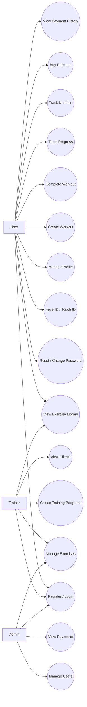
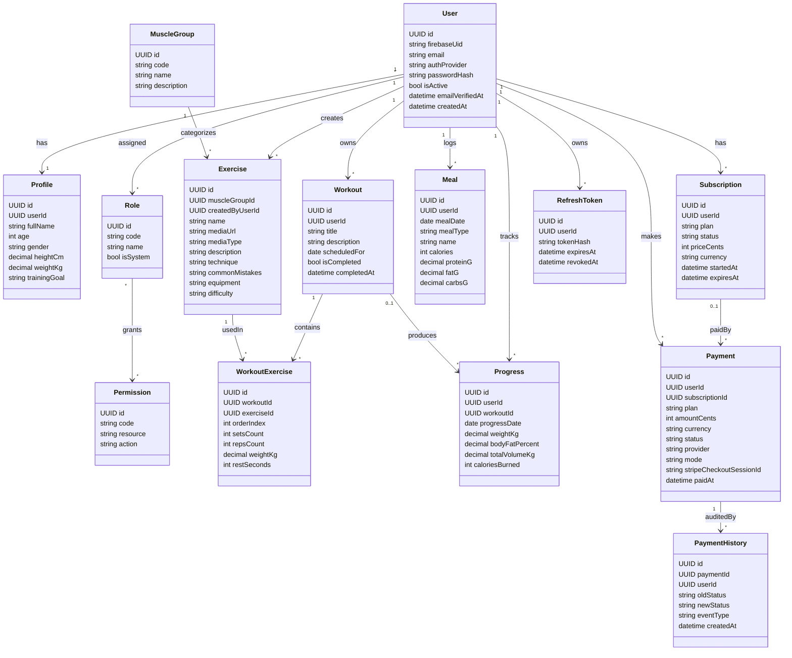
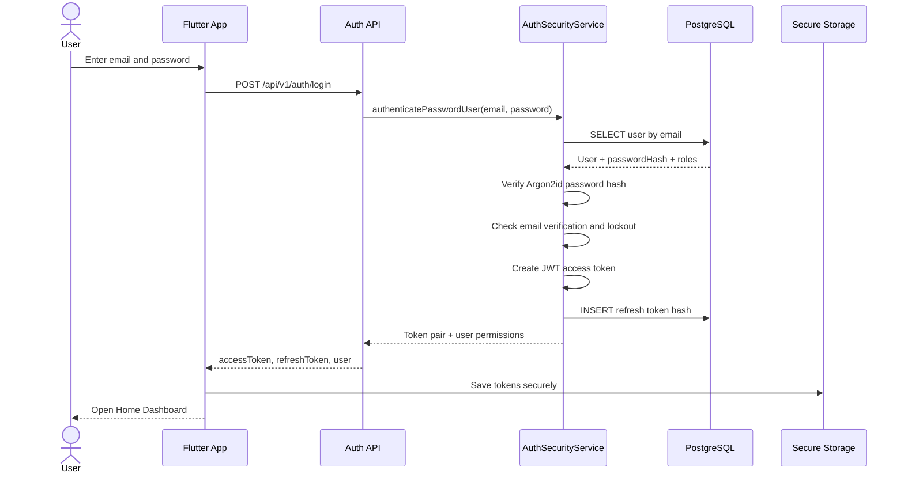
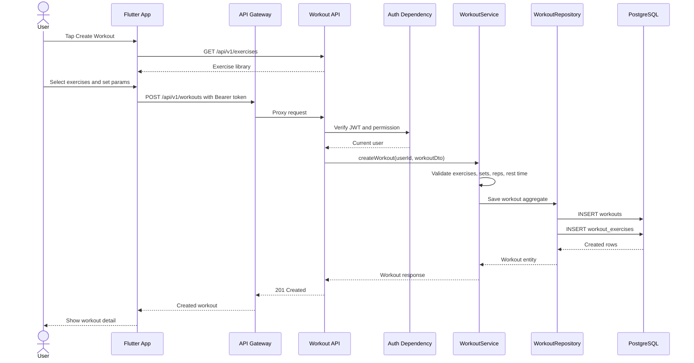
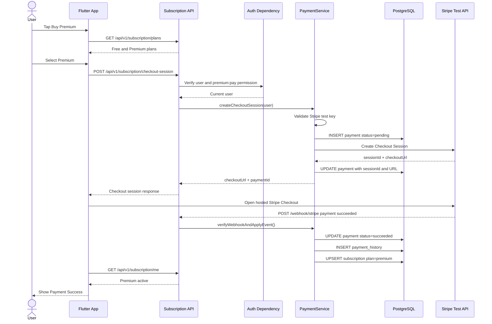
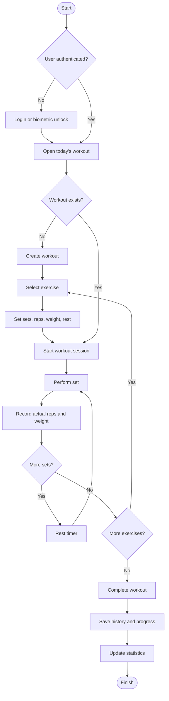
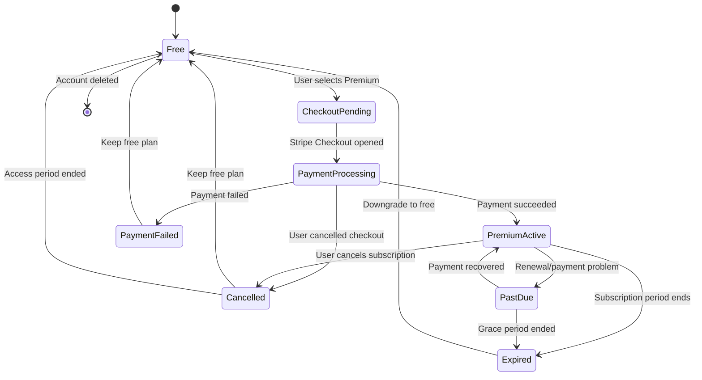
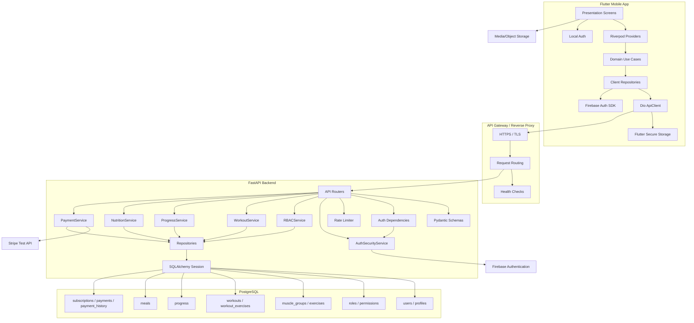
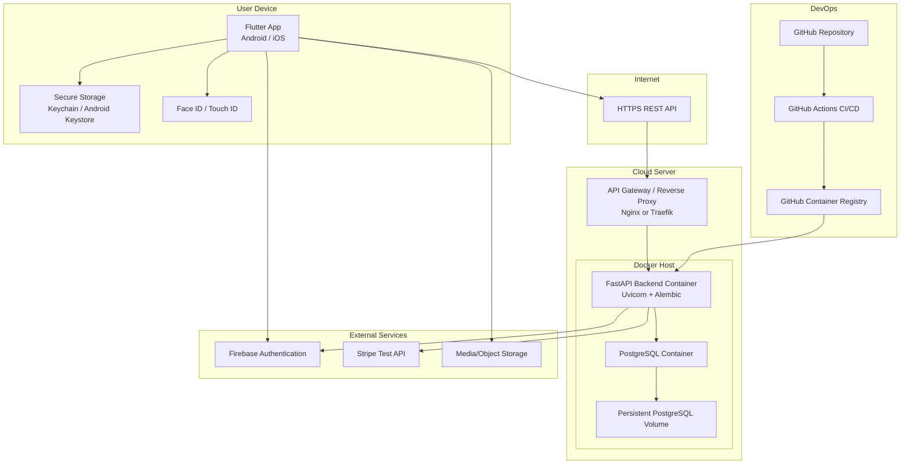

# FitTrack - UML документація

## 1. Призначення UML документації

Цей документ описує ключові UML-діаграми для курсового проєкту FitTrack. Діаграми показують функціональні можливості системи, основні класи предметної області, взаємодію мобільного застосунку з backend, процес тренування, життєвий цикл Premium-підписки, компоненти системи та deployment-структуру.

Технологічний стек:

- Flutter mobile app для Android та iOS.
- Python FastAPI backend.
- PostgreSQL database.
- Firebase Authentication.
- Stripe Test API.

## 2. Use Case Diagram

### Пояснення

Use Case Diagram показує, які ролі взаємодіють із системою FitTrack та які функції вони можуть виконувати. У системі є три основні актори: User, Trainer та Admin.

### Діаграма

### Основні сутності

| Сутність | Опис |
| --- | --- |
| `User` | Звичайний користувач, який тренується, веде прогрес, харчування та купує Premium |
| `Trainer` | Тренер, який створює програми тренувань і працює з клієнтами |
| `Admin` | Адміністратор, який керує користувачами, вправами та платежами |
| `FitTrack System` | Мобільний застосунок і backend API |

### Зв'язки

- `User` має доступ до персональних сценаріїв: профіль, вправи, тренування, прогрес, харчування, Premium.
- `Trainer` має доступ до тренерських сценаріїв: програми, клієнти, додавання вправ.
- `Admin` має доступ до адміністративних сценаріїв: користувачі, вправи, платежі.
- Усі ролі проходять автентифікацію перед використанням захищених функцій.

## 3. Class Diagram

### Пояснення

Class Diagram показує основні сутності предметної області FitTrack та зв'язки між ними. Діаграма відповідає структурі PostgreSQL бази даних і backend ORM-моделей.

### Діаграма

### Основні сутності

| Сутність | Опис |
| --- | --- |
| `User` | Обліковий запис користувача |
| `Profile` | Анкетні та фізичні параметри користувача |
| `Role`, `Permission` | RBAC-модель доступу |
| `Exercise`, `MuscleGroup` | Бібліотека вправ і категорії м'язів |
| `Workout`, `WorkoutExercise` | Тренування та вправи всередині тренування |
| `Progress` | Дані прогресу користувача |
| `Meal` | Харчування та макронутрієнти |
| `Subscription`, `Payment`, `PaymentHistory` | Premium-підписка, платежі та аудит |
| `RefreshToken` | Backend refresh token у hashed form |

### Зв'язки

- `User` має один `Profile`.
- `User` може мати багато `Workout`, `Progress`, `Meal`, `Payment`.
- `Workout` складається з багатьох `WorkoutExercise`.
- `Exercise` належить до одного `MuscleGroup`.
- `User` має багато ролей, а `Role` має багато permissions.
- `Subscription` пов'язана з платежами, а кожен `Payment` має audit records у `PaymentHistory`.

## 4. Sequence Diagram - Login

### Пояснення

Sequence Diagram Login показує процес входу користувача через backend JWT flow. Користувач вводить email/password у Flutter, backend перевіряє пароль, створює access token і refresh token, після чого Flutter зберігає токени у secure storage.

### Діаграма

### Основні сутності

| Сутність | Опис |
| --- | --- |
| `Flutter App` | UI та client-side auth flow |
| `Auth API` | FastAPI endpoint для входу |
| `AuthSecurityService` | Перевірка пароля, JWT, refresh token |
| `PostgreSQL` | Збереження users і refresh_tokens |
| `Secure Storage` | Безпечне збереження токенів на пристрої |

### Зв'язки

- Flutter надсилає credentials до Auth API.
- Auth API делегує перевірку сервісу безпеки.
- Service читає користувача з PostgreSQL.
- Refresh token зберігається у БД тільки як hash.
- Access/refresh tokens зберігаються у Flutter Secure Storage.

## 5. Sequence Diagram - Creating Workout

### Пояснення

Ця діаграма показує створення власного тренування користувачем. Користувач обирає вправи з бібліотеки, вказує кількість підходів, повторень, вагу та час відпочинку. Backend перевіряє авторизацію, валідує дані та зберігає тренування у PostgreSQL.

### Діаграма

### Основні сутності

| Сутність | Опис |
| --- | --- |
| `Workout API` | Endpoint створення тренування |
| `Auth Dependency` | Перевірка JWT та permissions |
| `WorkoutService` | Бізнес-логіка тренування |
| `WorkoutRepository` | Запис у таблиці `workouts` та `workout_exercises` |
| `Exercise Library` | Джерело вправ для workout builder |

### Зв'язки

- Flutter отримує вправи з API.
- Користувач формує workout payload.
- API Gateway передає запит у FastAPI.
- Backend перевіряє користувача та права.
- `WorkoutService` гарантує коректність параметрів.
- `WorkoutRepository` зберігає workout aggregate у транзакції.

## 6. Sequence Diagram - Payment

### Пояснення

Payment sequence показує тестову оплату Premium через Stripe. FitTrack не зберігає реальні банківські картки. Backend створює Stripe Checkout Session у test mode, зберігає локальний запис платежу, а успішний статус підтверджується webhook або test-confirm endpoint.

### Діаграма

### Основні сутності

| Сутність | Опис |
| --- | --- |
| `Subscription API` | Endpoints Premium, Checkout, Payment History |
| `PaymentService` | Створення checkout, webhook, статус платежу |
| `Stripe Test API` | Тестовий платіжний провайдер |
| `payments` | Локальний запис платежу |
| `payment_history` | Аудит зміни статусів |
| `subscriptions` | Поточний Premium-статус користувача |

### Зв'язки

- Flutter ініціює Premium purchase.
- Backend створює локальний `pending` payment.
- Stripe повертає hosted checkout URL.
- Після успішної оплати Stripe надсилає webhook.
- Backend оновлює payment, payment history і subscription.
- Дані банківської картки не проходять через FitTrack backend.

## 7. Activity Diagram - Training Process

### Пояснення

Activity Diagram описує процес проходження тренування: користувач відкриває тренування, виконує вправи, фіксує підходи, після завершення система зберігає історію та оновлює прогрес.

### Діаграма

### Основні сутності

| Сутність | Опис |
| --- | --- |
| `Workout` | План тренування |
| `WorkoutExercise` | Вправа з параметрами виконання |
| `Training Session` | Фактичне проходження тренування |
| `Progress` | Результат тренування та статистика |
| `Rest Timer` | Час відпочинку між підходами |

### Зв'язки

- Якщо тренування не існує, користувач створює його.
- Під час тренування користувач проходить вправи й підходи.
- Після кожного підходу система може запускати таймер відпочинку.
- Після завершення тренування зберігається історія та оновлюється прогрес.

## 8. State Diagram - Subscription Status

### Пояснення

State Diagram показує життєвий цикл підписки користувача. Користувач починає з Free plan, може перейти у Premium після успішного тестового платежу, а також може втратити Premium через помилку платежу, завершення строку або скасування.

### Діаграма

### Основні сутності

| Стан | Опис |
| --- | --- |
| `Free` | Безкоштовний тариф |
| `CheckoutPending` | Створено локальний payment і Stripe checkout session |
| `PaymentProcessing` | Користувач проходить Stripe Checkout |
| `PremiumActive` | Premium активний |
| `PaymentFailed` | Платіж неуспішний |
| `PastDue` | Проблема з оплатою або продовженням |
| `Cancelled` | Checkout або підписку скасовано |
| `Expired` | Строк Premium завершився |

### Зв'язки

- `Free` переходить у `CheckoutPending` після вибору Premium.
- `PaymentProcessing` переходить у `PremiumActive` тільки після підтвердження Stripe.
- `PaymentFailed` та `Cancelled` повертають користувача до Free plan.
- `PremiumActive` може стати `PastDue`, `Cancelled` або `Expired`.
- `Expired` завжди повертає користувача до Free plan.

## 9. Component Diagram

### Пояснення

Component Diagram показує внутрішню структуру FitTrack: Flutter client, API Gateway, FastAPI backend, PostgreSQL database та зовнішні сервіси.

### Діаграма

### Основні сутності

| Компонент | Опис |
| --- | --- |
| `Flutter Mobile App` | Client layer |
| `API Gateway` | HTTPS endpoint, routing, health checks |
| `FastAPI Backend` | API, бізнес-логіка, security, integrations |
| `PostgreSQL` | Основне сховище даних |
| `Firebase Authentication` | Автентифікація |
| `Stripe Test API` | Тестові платежі |
| `Media/Object Storage` | Медіа вправ |

### Зв'язки

- Flutter звертається до API Gateway через HTTPS.
- API Gateway проксуює запити до FastAPI.
- FastAPI викликає services і repositories.
- Repositories працюють із PostgreSQL через SQLAlchemy.
- AuthService інтегрується з Firebase.
- PaymentService інтегрується зі Stripe Test API.
- Flutter завантажує media assets через URL.

## 10. Deployment Diagram

### Пояснення

Deployment Diagram показує фізичне розміщення компонентів системи: мобільний пристрій користувача, cloud server з Docker containers, PostgreSQL volume, зовнішні сервіси та CI/CD pipeline.

### Діаграма

### Основні сутності

| Сутність | Опис |
| --- | --- |
| `User Device` | Смартфон з Android або iOS |
| `Cloud Server` | Сервер, на якому працює backend |
| `Docker Host` | Середовище запуску FastAPI та PostgreSQL containers |
| `PostgreSQL Volume` | Persistent storage для бази даних |
| `GitHub Actions` | CI/CD pipeline |
| `GitHub Container Registry` | Registry для backend Docker image |

### Зв'язки

- Мобільний застосунок взаємодіє з backend тільки через HTTPS.
- API Gateway передає запити до backend container.
- Backend container працює з PostgreSQL container.
- PostgreSQL зберігає дані у persistent volume.
- GitHub Actions збирає Docker image та публікує його в registry.
- Cloud server отримує новий image під час deployment.

## 11. Підсумок

UML-документація FitTrack покриває:

- функціональні можливості системи через Use Case Diagram;
- доменну модель через Class Diagram;
- ключові runtime-сценарії через Sequence Diagrams;
- процес тренування через Activity Diagram;
- життєвий цикл Premium через State Diagram;
- програмну структуру через Component Diagram;
- фізичне розгортання через Deployment Diagram.

Ці діаграми підтверджують, що FitTrack має повноцінну архітектуру мобільного застосунку з backend, базою даних, зовнішніми сервісами, авторизацією, ролями, платежами та CI/CD-ready deployment model.
